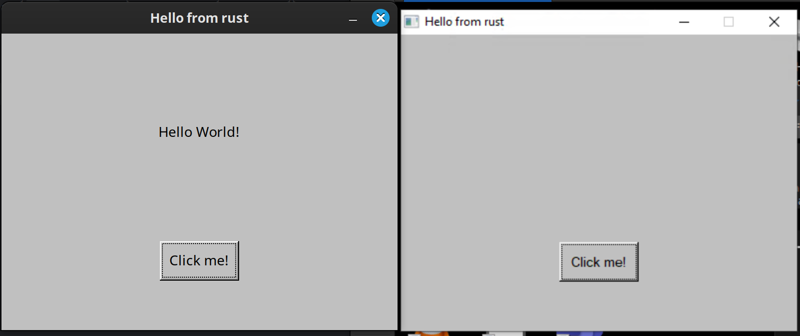

build for X and mustdie(approx.):

    sudo dnf install libXft-devel libXinerama-devel libXcursor-devel libXfixes-devel pango-devel libstdc++-static
    rustup target add x86_64-pc-windows-gnu
    rustup component add rust-src
    sudo dnf install mingw64-gcc
    cargo build --target x86_64-pc-windows-gnu --release

